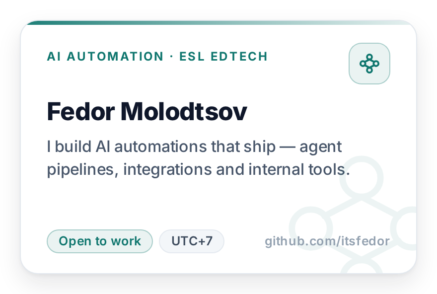
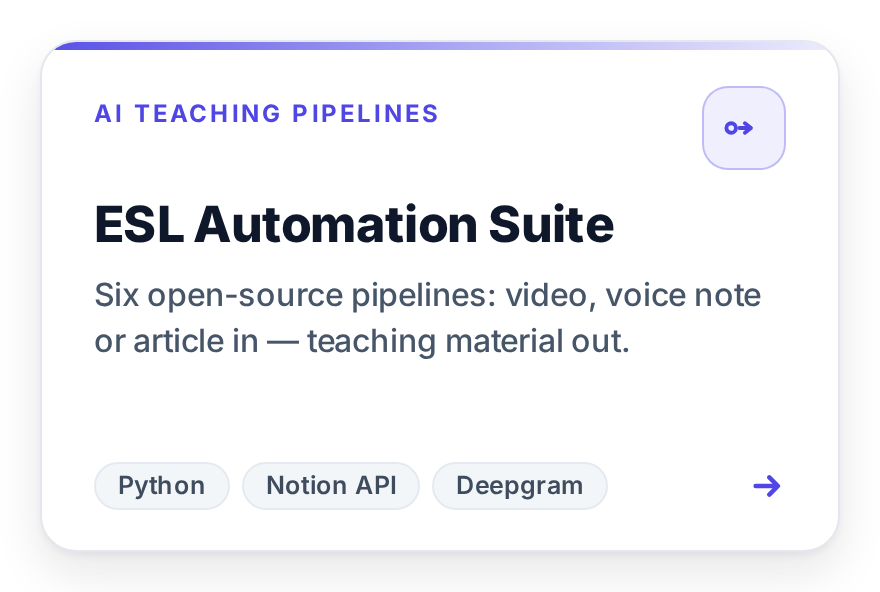
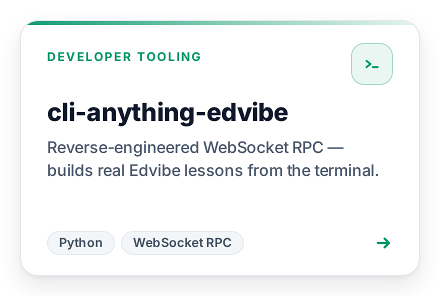
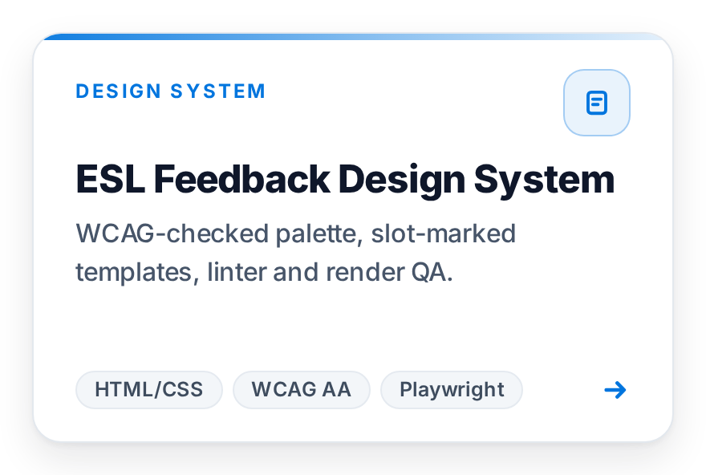
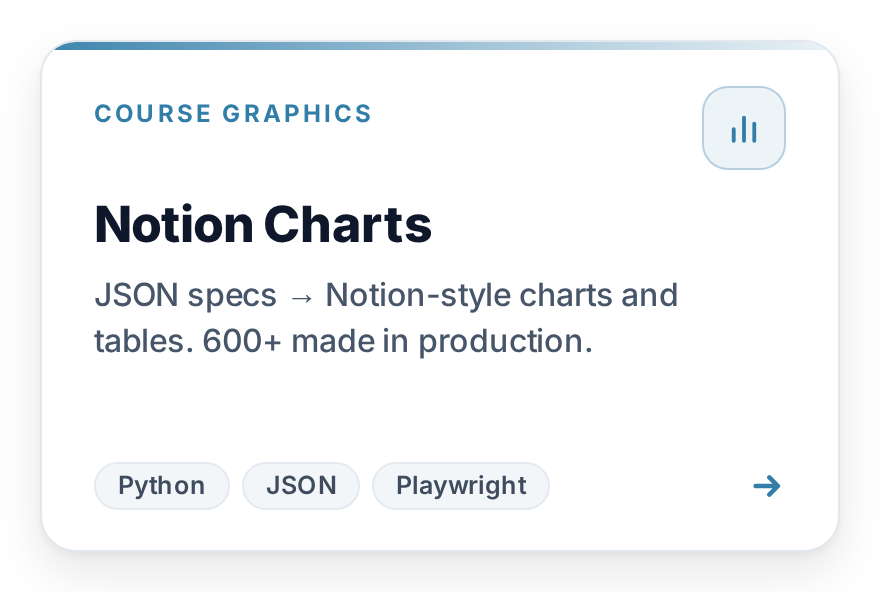
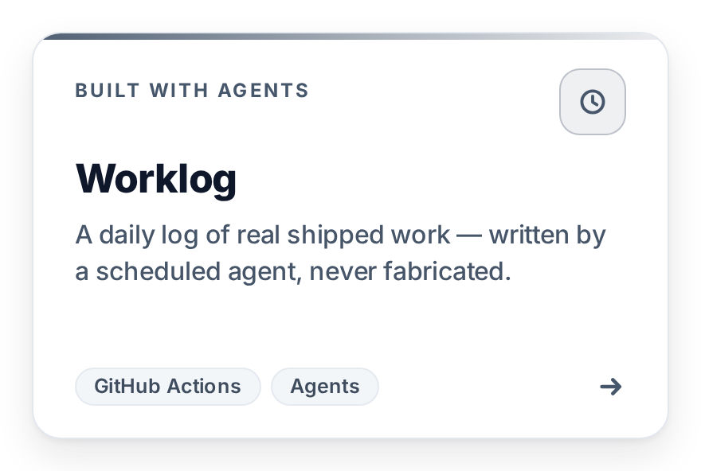

  <picture><source media="(prefers-color-scheme: dark)" srcset="assets/cards/about-dark.png"></picture>
  <a href="https://github.com/itsfedor/esl-automation-suite"><picture><source media="(prefers-color-scheme: dark)" srcset="assets/cards/esl-automation-suite-dark.png"></picture></a>
  <a href="https://github.com/itsfedor/cli-anything-edvibe"><picture><source media="(prefers-color-scheme: dark)" srcset="assets/cards/cli-anything-edvibe-dark.png"></picture></a>
  <a href="https://github.com/itsfedor/esl-feedback-design-system"><picture><source media="(prefers-color-scheme: dark)" srcset="assets/cards/esl-feedback-design-system-dark.png"></picture></a>
  <a href="https://github.com/itsfedor/notion-charts"><picture><source media="(prefers-color-scheme: dark)" srcset="assets/cards/notion-charts-dark.png"></picture></a>
  <a href="https://github.com/itsfedor/worklog"><picture><source media="(prefers-color-scheme: dark)" srcset="assets/cards/worklog-dark.png"></picture></a>

<h1 align="center">Fedor Molodtsov · AI Automation Engineer</h1>

  I build AI automations that ship — agent pipelines, integrations and tools that replace hours of manual work.

Everything in this account runs in production for a private ESL teaching practice
(thousands of lessons delivered): lesson generators, a voice-note → Notion student
tracker, AI-scored Minecraft plugins, interactive web demos.

**Currently building:** a video → lesson-guide pipeline (Deepgram transcription → normalizer → teacher's-guide generator) and an Edvibe lesson-building agent.

**Open to:** contract AI-automation work and remote roles (UTC+7).

  
  
  
  
  

## Selected projects

| Project | What it does | Proof | Stack |
|---|---|---|---|
| [**ESL Automation Suite**](https://github.com/itsfedor/esl-automation-suite) | AI teaching pipelines: lesson-guide generator, voice → Notion student tracker, video-review summaries (Deepgram), TV-episode homework, Edvibe lesson builder | 6 pipelines · 3 installable agent skills | Python · LLM APIs · Notion · Deepgram |
| **ESL Minecraft plugins** — [chat2earn](https://github.com/itsfedor/chat2earn) · [englishprogression](https://github.com/itsfedor/englishprogression) · [vocabquiz](https://github.com/itsfedor/vocabquiz) · [dailyenglish](https://github.com/itsfedor/dailyenglish) | 4 PaperMC plugins that turn a Minecraft server into an English classroom: AI-scored chat payouts, earnings-driven level-ups, vocab quizzes, daily tasks | 4 plugins · ~2,500 lines of Java · Vault + LuckPerms | Java · PaperMC · Groq |
| [**Worklog**](https://github.com/itsfedor/worklog) | Daily log of what actually shipped, written by a scheduled agent | machine-readable · one entry per workday | Automation |

## Recent activity

<!-- WORKLOG:START -->
- **2026-10-09**: ESL Feedback Design System v1.5 — the revised-variant blocks retired from the canon, migrated out of the fresh reviews and their live copies, and the public repo synced to v1.5; the next C1 spoken lesson (WSJ's "How Global Trade Runs on U.S. Dollars") built and live-verified; the teaching-platform landing's legal documents published, clearing its setup banner; the GitHub profile curated — five pinned projects, fresh social previews for the two newest repos, an off-topic demo retired; the sandbox got its own browser (blocklists, warmup, launch scripts); the dashboard's weekday noon refresh ran clean.
- **2026-10-08**: The teacher dashboard gained review read-receipts — server-recorded "opened / not opened" status per review (a student's own reads only; teacher view-as excluded), an "unopened" filter, and a 46-check QA suite in dormant + active modes; the refresh moved to weekdays at noon and a fresh scan deployed byte-identical to both edge nodes.
- **2026-10-07**: Teacher dashboard reworked — moved to itsfedor.cc/dashboard with English-first cards, compact status chips and teacher-gated avatars, smart back navigation, and a Mon/Wed/Fri scan; two new public repos published ([notion-charts](https://github.com/itsfedor/notion-charts), [esl-feedback-design-system](https://github.com/itsfedor/esl-feedback-design-system)); the account's READMEs slimmed to theme-adaptive banners; two spoken lessons built and live-verified; the platform's book folders repaired after a silent-detach quirk.
- **2026-10-06**: Built and live-verified the next B2 spoken lesson (the eighteenth verified build); the student area grew to every student with analyses — seven legacy reviews rebuilt to the current design canon, all suites green on production; closed the platform's entire homework queue (29 sheets, three new reviews published); launched the teacher dashboard at itsfedor.cc/progress/dashboard.
- **2026-10-05**: Portfolio re-audit + PII scrub (three histories rewritten, verified); [Prism landing](https://itsfedor.github.io/prism-landing/) and theme-adaptive banners shipped; a new B2 spoken lesson built and live-verified; the itsfedor.cc student area reworked — new IELTS review, privacy-hardened cabinet, and legal pages (/offer/, /privacy/) live.
<!-- WORKLOG:END -->

_Appended by a scheduled agent when there's real work to log. Full history: [worklog](https://github.com/itsfedor/worklog)._

## Get in touch

- GitHub: [@itsfedor](https://github.com/itsfedor)
- Telegram: [@itsfedor](https://t.me/itsfedor)
- Open to AI-automation and EdTech collaborations. Pick a repo, check the README, and let's talk.
